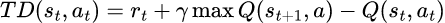

# Q-learning-on-grid

> Problem Statement: Consider a grid world of size n × n where 10% of the states are blocked and one state is set as a goal state. Using reinforcement learning algorithm assigned to your group (see below table), implement the solution (write code in Python) to compute the optimum policy to reach the goal state from a given staring state. Your policy is required to be of stochastic nature, and you can use/initialize the required values for your algorithm.

Q-learning involves an agent operating in an environment with states & rewards (inputs) and actions (outputs)
- involves model free environment ie. the agent is not seeking to learn about mathematical model or probability distribution.
- uses a trial based approach.

### Characteristics of Q-learning models:
- All fundamnetal characteristics of reinforcement learning like input/output system, rewards, markov decision process are applicable.
- The number of possible states are finite.
- The number of actions is finite. 

### Q-value
Indicates the quality of action A in given state S : Q(S, A)

### Temporal differences
How much the Q-value for the action taken in previous action has to be changed based on what the agent has learned about the Q-values for the current state's actions.

