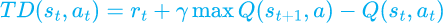

# Q-learning-on-grid

> Problem Statement: Consider a grid world of size n × n where 10% of the states are blocked and one state is set as a goal state. Using reinforcement learning algorithm assigned to your group (see below table), implement the solution (write code in Python) to compute the optimum policy to reach the goal state from a given staring state. Your policy is required to be of stochastic nature, and you can use/initialize the required values for your algorithm.


Q-learning involves an agent operating in an environment with states & rewards (inputs) and actions (outputs)
- involves model free environment ie. the agent is not seeking to learn about mathematical model or probability distribution.
- uses a trial based approach.

### Characteristics of Q-learning models:
- All fundamnetal characteristics of reinforcement learning like input/output system, rewards, markov decision process are applicable.
- The number of possible states are finite.
- The number of actions is finite. 


### Q-value
Indicates the quality of action A in given state S : Q(S, A)

### Temporal differences
How much the Q-value for the action taken in previous action has to be changed based on what the agent has learned about the Q-values for the current state's actions.



### Bellman equation
Tells us whar new value to use as the Q-value for the action taken in previous state.


### Explantation: 
Defining the environment - 
- Sates: The state of the system is the row and column number of the grid, terminal states are the walls in the grid.
- Actions: The defined actions are up, down, left, right
- Rewards: For the movable cells, the reward is -1, -100 for walls and +100 for ending point.

Taking user input for size of grid, ending cell.
```python
#taking user input for the size of the grid:
n = int(input("Enter the size of the grid: "))
rows = columns = n;

#taking input for starting coordinates 
sr, sc = input("Enter the coordinates of starting position: ").split()
sr = int(sr)
sc = int(sc)
```


Initialising Q-table with zeroes
```python
#making q-table for the matrix by initialising with zeroes
q_table = np.zeros((rows, columns, 4))
q_table
```
Defining actions in a list 
```python
actions = ['left', 'right', 'down', 'up']
```

Making the reward matrix: The 10% of total states are made as walls and remaining 90% are free movable paths.
```python 
#builiding the required grid: 
rewards = np.full((n, n), -100.0)

#filling the 90% part of the grid with -1
ninety_percent = (int)(n*n*0.90)

lst = random.sample(range(0, n*n), ninety_percent)

movable_cells = []
for i in lst:
    movable_cells.append([i//n, i%n])

for i in movable_cells:
    rewards[i[0]][i[1]] = -1.0

#for ending position:
rewards[sr, sc] = 100.0
```

This function checks if the current state is a terminal state or not
```python
def is_terminal_state(current_r, current_c):
    if rewards[current_r, current_c] == -1.0:
        return False
    else:
        return True
```

While the next state is terminal state, the random values are checked and non-terminal states are found.
```python
def get_start():
    current_r = np.random.randint(rows)
    current_c = np.random.randint(columns)


    while is_terminal_state(current_r, current_c):
        current_r = np.random.randint(rows)
        current_c = np.random.randint(columns)

    return current_r, current_c
```

The next action from the current state is defined 
```python
def get_next_action(current_r, current_c, ep):
    if np.random.random() < ep:
        return np.argmax(q_table[current_r, current_c])
    else:
        return np.random.randint(4)
```

The shortest path is found from the state : (r, c)
```python
def get_shortest_path(r, c):
    if is_terminal_state(r, c):
        return []
    else:
        current_r, current_c = r, c
        shortest_path = []
        shortest_path.append([current_r, current_c])

        while not is_terminal_state(current_r, current_c):
            action_idx = get_next_action(current_r, current_c, 1.0)

            current_r, current_c = get_next_location(current_r, current_c, action_idx) 

            shortest_path.append([current_r, current_c])

        return shortest_path
```


Training the model by selecting the various hyperparameters: 
```python
ep = 0.9 #expliotation and exploration ratio 
alpha = 0.9 #learning rate
gamma = 0.9 #discount factor
episodes = 500 #the number of episodes 


for it in range(episodes):
    row, col = get_start()


    while not is_terminal_state(row, col):
        action_idx = get_next_action(row, col, ep)

        old_r, old_c = row, col
        row, col = get_next_location(row, col, action_idx)

        reward = rewards[row, col]
        old_q_value = q_table[old_r, old_c, action_idx]
        temp_diff = reward + (gamma * np.max(q_table[row, col])) - old_q_value

        new_q_value = old_q_value + (alpha * temp_diff)
        q_table[old_r, old_c, action_idx] = new_q_value


print("Finished")
```

Printing the shortest path
```python
#Printing the shortest path from the given vertices:
print(get_shortest_path(4, 0))
```

